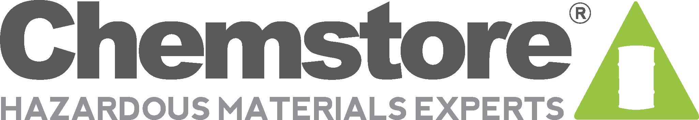
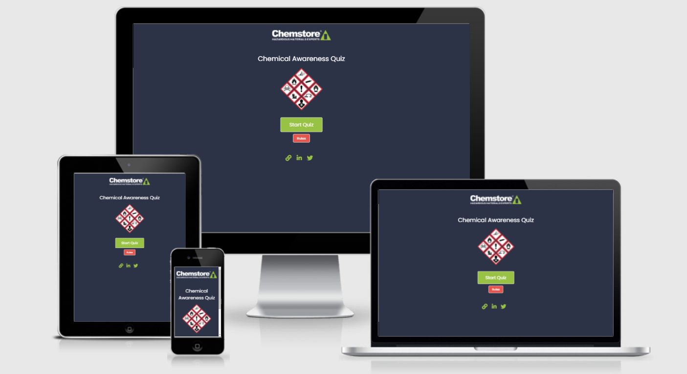
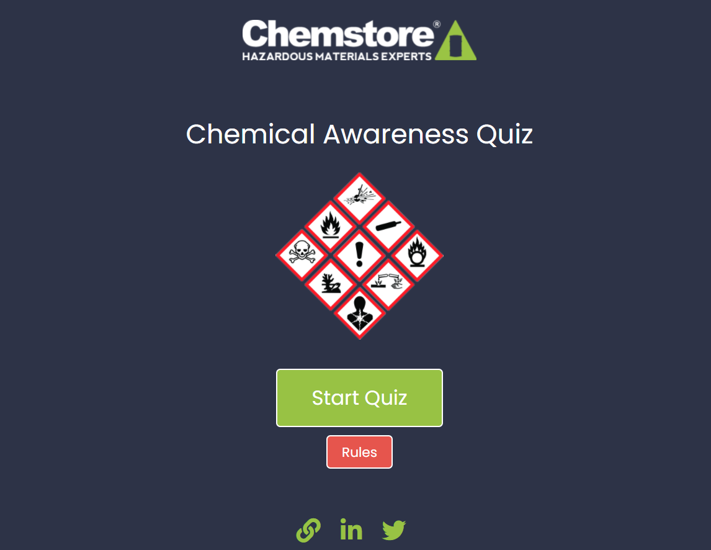
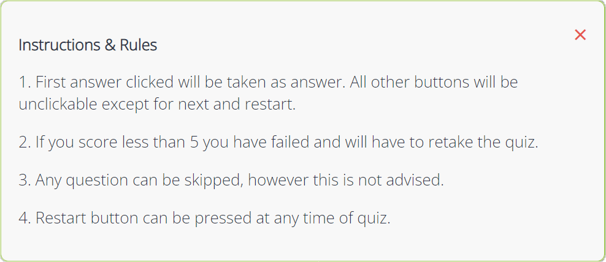
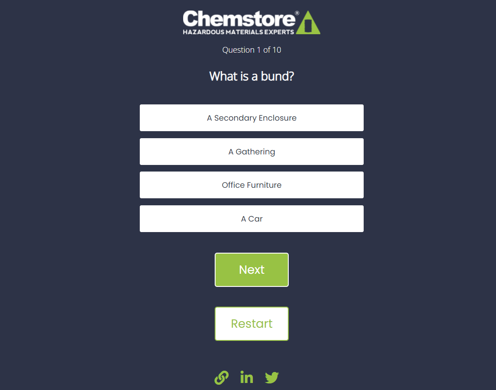
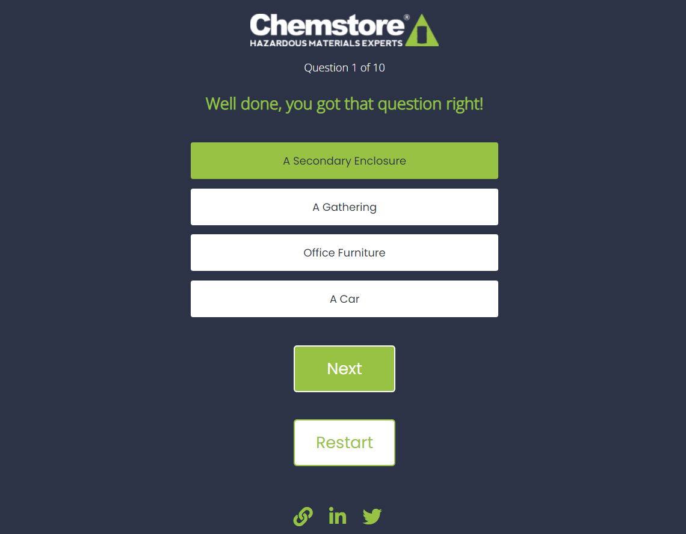
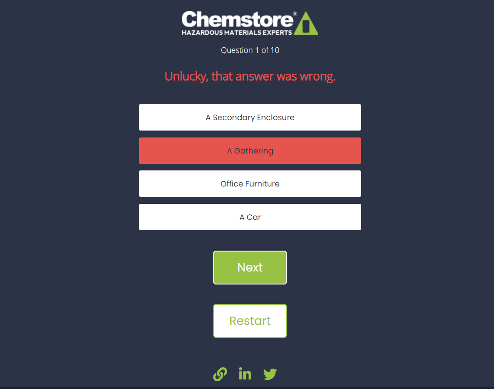
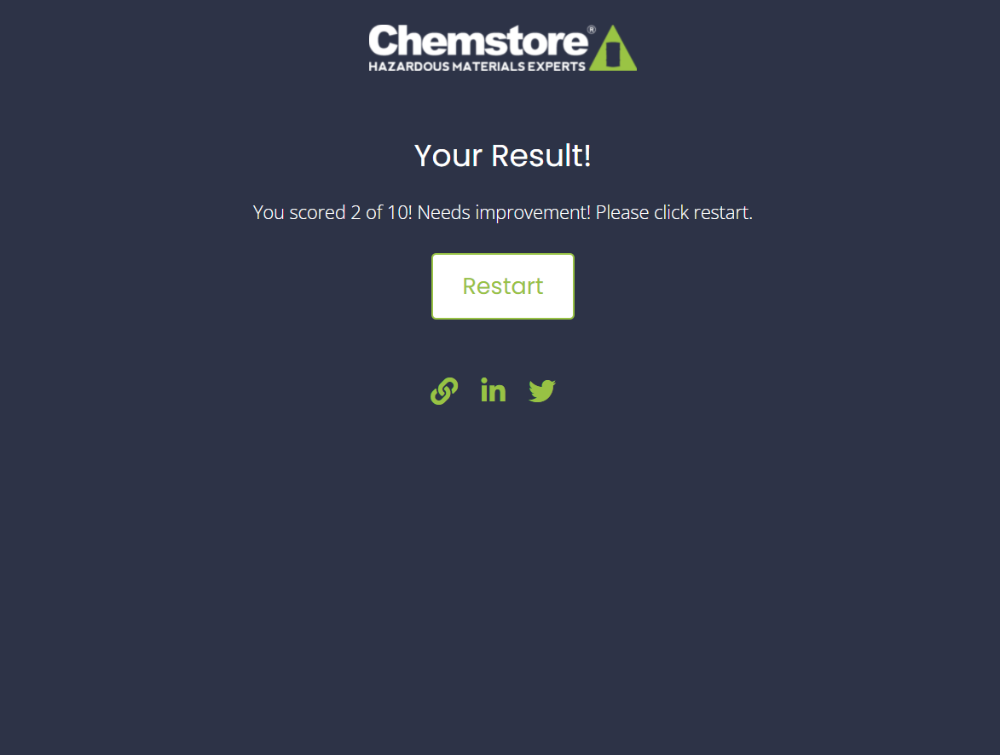
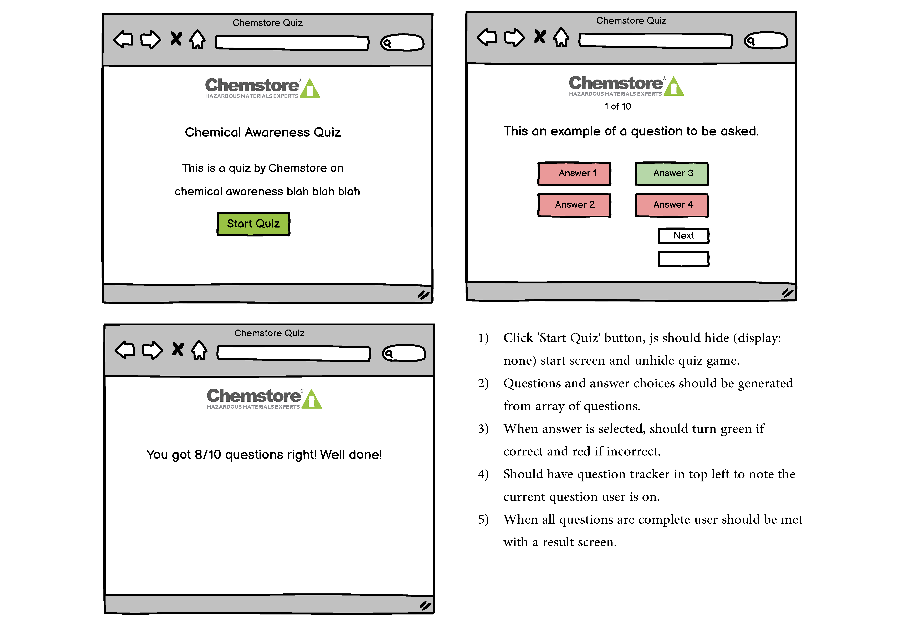
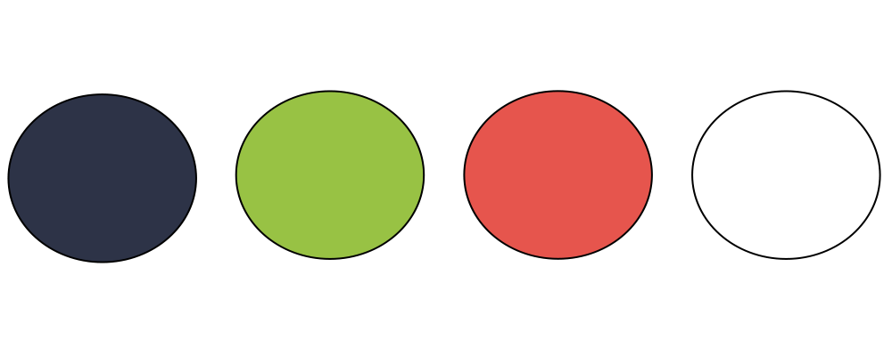

# Chemstore Group Chemical Safety Quiz



[Chemstore Chemical Awareness Quiz Live Site](https://jamiet966.github.io/project-portfolio-2/)

Chemstore Group conduct chemical awareness training throughout Ireland throughout the year, this quiz has been designed to aid in that training. This will allow the business to ensure clients are taking the information on board. This quiz will also add a fun, interactive element for their clients that will liven up their training days.



**The business goals of this quiz:**
* Adds something different to their training days.
* Break up the monotony of training days that can last several hours. 
* Ensure that clients are paying attention by testing their knowledge.

**The customer goals of this quiz:**
* Clear, easy and intuitive to use the quiz.
* Provide a fun and interactive quiz to users.
* To achieve a passing score.

## **Features**

### Start Page 

* Start page features the Chemstore logo, a title, an image of chemical CPL symbols, links at the bottom to access the company's website, LinkedIn and Twitter. As well as a start button that initiates the quiz and a rules button that pops out a modal with rules and instructions.



### Rules Modal

* This modal displays the instructions and rules for the quiz.



### Quiz Screen

* The quiz screen displays the same logo and links at the botttom as all other pages on this quiz.

* Their is a question section, an answer choice section containing four button with a choice in each. 

* The quiz screen also features a next and restart quiz button.



### Correct

* When a correct answer is selected the choice button that was selected will turn green with a message in the question zone displaying green correct text.



### Incorrect

* When an incorrect answer is selected the choice button that was selected will turn red with a message in the question zone displaying red incorrect text.



### Result Page

* The result page shows when the quiz has finished and displays your score.



### Features Left to Implement in The Future

* In the future, I would like to add JavaScript that would allow the animation on the "What We Love About Cheeky Monkeys" images to start when they are scrolled into view.

* Cookies pop up - A pop-up banner at the bottom of the webpage to allow cookies, cookie settings or reject cookies. 

* A CAPTCHA function on the contact form to prevent spam from bots.

* A blog page so the business could post articles relevant to their industry, this would also help boost SEO if used correctly.

## **Testing**

### Validator Testing

* [W3C Markup Validation](https://validator.w3.org/)
* [W3C CSS Validation](https://jigsaw.w3.org/css-validator/)

I validated my HTML and CSS with the W3C Markup Validator and W3C CSS Validator to check the validity of my code.

### Client Story Testing

* The most common path through the website is for the user to scroll down the main page, to prevent them having to scroll back up to the top of the page to navigate, I have added navigation links to the footer of the website.

* The map section, the address on the contact page and the address can be found at the bottom of each page in the footer.

* The contact page has the address, phone number and email address on the left side. With a contact form on the right side to leave a message.

### Manual Testing

* I have tested all links and all internal and external links are fully working. I have also tested when clicking the site logo and that returns the user to the home page. Any external links have a ```target="_blank"```, ensuring they open in a new tab.

* The contact form has every field set to required, the form will not allow you to submit unless every field has content and one of the radio buttons has been selected. The email address field will not accept an invalid email format. When you press submit, you are taken to this page showing that all data has been captured correctly.


* The website has been tested across all major browsers (Chrome, Firefox, Edge, Safari, etc) and all emulated mobile devices using Google Chrome Developer Tools. While testing I realised that my website was not fully responsive on very small screens, such as an iPhone 5. I had to add a width and max-width to resolve this.

## **Bugs**

* I found one minor bug when running the W3C Markup Validation. I have ignored this warning as this section does not require a heading.


## **User Experience**

### Strategy

The client's goal was to have a new and up to date B2C website that was simple and intuitive to use. The website should demonstrate the key benefits and learnings to be gained by enrolling their child in Cheeky Monkeys Playschool. It should also have the address, a map and contact details listed so the customer can easily find them. A gallery was also requested to demonstrate social proof.

### Scope

I discussed with the client and we decided the scope of this project together. I gave an overview of what was on the table. For example, the home page, gallery and contact page were on the table. A blog page was discussed but was left out of the scope, this can be added at a later date.

### Structure

For the main structure, I implemented a responsive header and footer with navigation elements. This allows the user to navigate to the home, gallery and contact page, whether they are at the top or the bottom of the website. 
On the Cheeky Monkeys contact form the submit button is orange with a white border but those colours invert when hovered over to demonstrate good interactive design.
A 404 page was created that tells the user something went wrong and then provides a link back to the home page.

### Skeleton

I created a wireframe using Balsamiq for the home page. I firstly, drew by hand roughly how I wanted Cheeky Monkey's home page to look.



### Surface

For colours, I colour picked the orange in the Cheeky Monkeys logo and used the Adobe colour wheel to select a palette but I could not find anything that looked aesthetically pleasing so I instead opted for a three colour palette.

```--off_white: #f8f8f8; --cm_orange: #B5772F; --text_color: #3a3a3a;```



## **Technologies**

1. HTML
2. CSS
3. JavaScript (For fontawesome icons)
4. Gitpod.io - for writing the code. Using the command line for committing and pushing to Git Hub
5. GitHub - Used to host repository
6. GIT - for version control of the project.
7. [FreeFormatter.com](https://www.freeformatter.com/html-formatter.html) - Used to beautify my HTML.
8. [Dan's Tools](https://www.cleancss.com/css-beautify/)

## **Deployment**

The website is hosted by GitHub Pages and the live page can be found here: [Cheeky Monkeys Playschool](https://jamiet966.github.io/project-portfolio-1/)

**The Steps I Took To Deploy on GitHub Pages:**

1. Went to github.com
2. Under Repositories click on the desired project.
3. Click on Settings just over the green Gitpod button.
4. On the left navigation menu, find and click Pages.
5. Under Source, change Branch to main and the files to /root and click save.
6. Wait a few minutes and your repository will be live on Github Pages.


As this website is hosted by GitHub pages it is directly deployed from the repository's master branch. This means that the deployed site will automatically update from any commits from the master branch of my repository.

**The Steps I Took To Push Changes to Live website:**

1. When have completed a section of code, in the terminal window: `git add .` or `git add index.html "or other file"`.
2. `git commit -m "Your commit message here`.
3. `git push`.

To run a local copy, you can clone into any editor by pasting this: `git clone https://github.com/JamieT966/project-portfolio-1.git` into your editor.

## **Credits**

### Content

* All content came from the Cheeky Monkeys Playschool owner, Rachel Tarpey. As well as the existing Cheeky Monkeys website

### Media

* All the stock imagery came from [Pexels](https://www.pexels.com/). The hero image and all gallery images.

* The three images in the What we love about Cheeky Monkeys! section was designed by Lauren Tarpey.

### Acknowledgments

* First and foremost my mentor Brian Macharia, has been an exceptional teacher to me, going above and beyond.

* [The Complete Guide to Flexbox](https://css-tricks.com/snippets/css/a-guide-to-flexbox/), I would not have been able to do complete this project without it. 

* I also found the YouTube video, created by Traversy Media particularly useful. [Flexbox CSS In 20 Minutes](https://www.youtube.com/watch?v=JJSoEo8JSnc&t=209s&ab_channel=TraversyMedia)